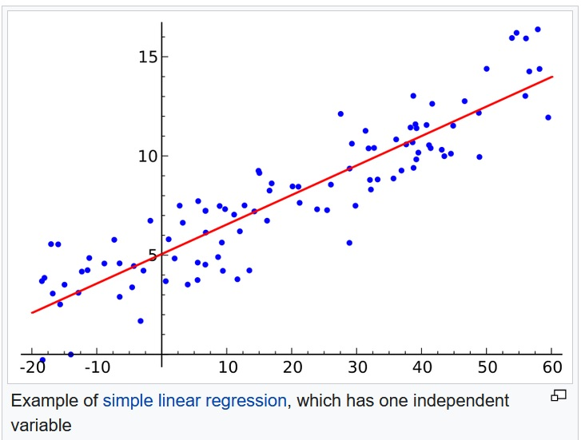
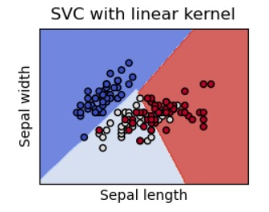
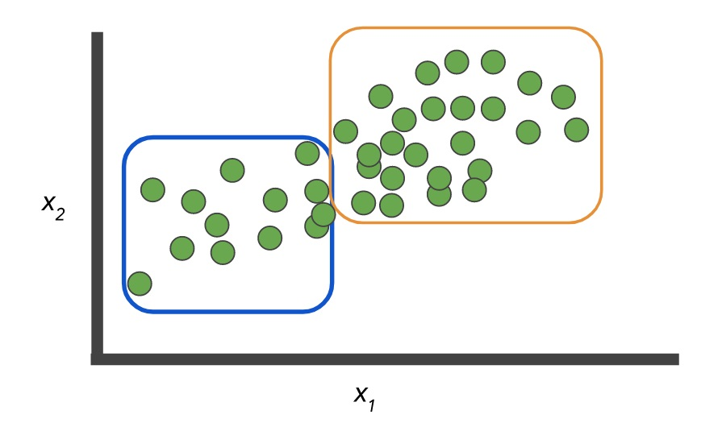
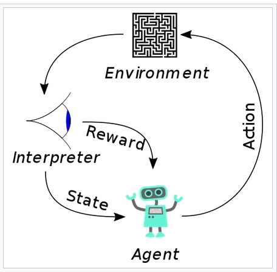

# Introduction to Machine Learning

[Machine Learning](https://en.wikipedia.org/wiki/Machine_learning) is the study of computer algorithms that *automatically* improves through experience, and by the *use of data*. Machine learning is not the same as programming, because it can automatically improve without more programming, but with more data.

Broadly speaking, there are three different types of machine learning:
- supervised learning, where the desired output for input data is already known.
- Unsupervised learning, where the output for the input data is automatically discovered.
- Reinforcement learning, where the machine learns through interaction with its environment.

## Supervised Learning

Supervised learning can be further subdivided into
- regression analysis
- classification

### Regression Analysis

In regression analysis, the input data contains:
- One or more independent variables
- one dependent variable.

The purpose of learning is to build a mathematical model to predict the dependent variable based on a new input independent variable.  An [example](https://en.wikipedia.org/wiki/Linear_regression) of a mathematical model is a linear model, which is the equation of a straight line that approximates the input data. 

Non-linear models are also possible, for example, the equation for a parabola, an ellipse, or an exponential function, or a power law distribution.

Once a regression model is built, it may be used to make predictions. For example, a model may be constructed to predict:
- Effect of different drug dosages on a disease.
- Effect of different amounts of spending.
- Effect of different amounts of incentives to motivate an outcome.

### Classification

For classification, the input data is labeled. It contains:
- one or more independent variables
- additional labeled data that specifies the category the input data belongs to.

The purpose of learning is to build a model to predict the the category for new input data. 

Here is an [example](https://scikit-learn.org/stable/modules/svm.html) classifying three different types of flowers. Each color blue, white, and red, represents a different type of flower. Note that the relationship is not a simple relationship between the flowers' sepal length and width.

Here is another example for semantic image segementation, to identify which 

In genearl, classification problems include:
- image recognition, including:
  - facial recognition, 
  - image classification
  - semantic segmentation: what's in each part of the image
  - medical imaging
  - optical character recognition
- voice recognition
- document classification
- sentiment analysis
- spam filter

It takes a lot of effort to classify a large number of data points. Somtimes it is possible for the machine to learn by first classifying a small subset, and using that classification to learn from the remainder of the data. This is called semi-supervised learning.

## Unspervised Learning

Unsupervised learning is used to automatically learn about structure in the data.  
- If data has known underlying relationship, such as a normal distribution, then unsupervised learning is used to find the parameters of that distribution.
- If data has no known underlying relationship, then clustering is used to automatically discover groups by identify what is common within each group, and uncommon across groups. Often new features can be discovered and used as input to other machine learning models.

Here is an [example view](https://developers.google.com/machine-learning/problem-framing/cases) of clustering, where 2 clusters are learned from additional dimensions in the data:

Applications of clustering analysis include:
- marketing research to identify different consumer segments
- recommendation engine 
- anomaly detection
- medical imaging

## Reinforcement Learning

In Reinforcement learning, the model is an agent that takes action in an environment. This then triggers a state change, and the reward of the new state is fed to the agent. The agent learns by balancing bewteen 
- exploring new actions that may lead to lead to higher long term reward
- exploiting actions with known rewards.

Examples of reinforcement learning include:
- Playing games, such as [Alpha Zero](https://en.wikipedia.org/wiki/AlphaZero) that plays chess and go, and [Deep Stack](https://arxiv.org/abs/1701.01724) that plays poker.
- [Data Center Power Reduction](https://deepmind.com/blog/article/deepmind-ai-reduces-google-data-centre-cooling-bill-40)