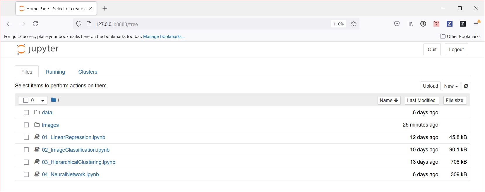
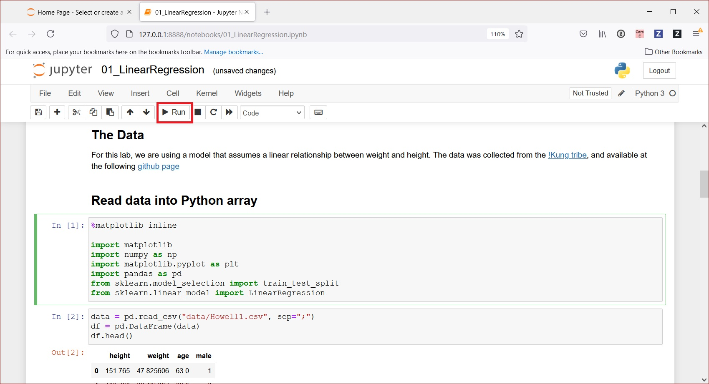
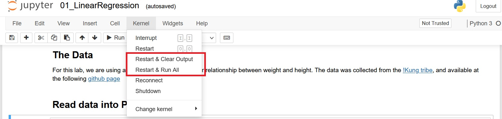

# Machine Learning is Not Programming

The  purpose of this repository is to showcase how machine learning differs from programming through illustrative samples, to help you develop intuition about how machine learning works. 

## Introduction to Machine Learning

Start with a [quick introduction](MachineLearningIntro.md) to machine lerning.

## Reading the Jupyter Notebooks

If you prefer to do some hands-on coding or experiments, proceed to the next section. Otherwise, just reading the included Jupyter notebooks is sufficient introduction to help you develop an intutuion about machine learning.

 For those who prefer just reading, we suggest you go through the Jupyter notebooks in this order:
- Get started with using [Linear Regression](01_LinearRegression.ipynb) to predict height from weight.
- Read how [Logistic Regression](02_ImageClassification.ipynb) is used to classify simple images such as hand written digits.
- Complete the last two in the order of your choosing:
  - Read about how [Hierarchical Clustering](03_HierarchicalClustering.ipynb) is used in unsupervised learning for data exploration.
  - Read about how [neural network and deep learning](04_NeuralNetwork.ipynb) is used in image classification of complext images.


## Interacting with the Jupyter notebooks

You are encouraged to try the interactive portions of the labs. Follow the steps below to build and run a docker image to run the lab: 


- Build docker image: `docker build -t ml-sample .`
- Run the image: `docker run -ti --rm ml-sample`
- After the container starts, it will print out several URLs for you to access the Jupyter notebook. Open a browser to access one of the URLs, one that best matches the network configuration for your environment. For example:
```
[I 15:21:18.001 NotebookApp] Use Control-C to stop this server and shut down all kernels (twice to skip confirmation).
[C 15:21:18.006 NotebookApp]

    To access the notebook, open this file in a browser:
        file:///root/.local/share/jupyter/runtime/nbserver-6-open.html
    Or copy and paste one of these URLs:
        http://2ceb3e0113e6:8888/?token=78e9ea63ddcd18aefc1fee847e90da81698e909ae406fa5a
     or http://127.0.0.1:8888/?token=78e9ea63ddcd18aefc1fee847e90da81698e909ae406fa5a
```
- From the browser, click on one of the Jupyter notebooks (any .ipynb file) to interact with it. We suggest you work on the notebooks in the same order as suggested in the last section.

### Quick Jupyter Notebook Tutorial

Read on if you need a quick tutorial on Jupyter notebook. 

When you first point your browser to the notebook, you'll see an initial screen. Click on your choice of the notebooks to start a new tab:




Each Jupyter notebook is divided into cells. Each cell may be a different type of content, for example, Markdown a snippet, or Jython code fragments. The output of executable code is also displayed, if it had been run previously. 




You may click on any cell to highlight it. You may change the code in the cell on the fly.  Click the `Run` button to run it.  For executable code, there is an number in brackets, such as `[1]`, or `[2]`, that shows the order in which the fragment is run. If it shows `[*]`, it means that it is queued up, but not yet run. This can happen if you are re-running everything from the beginning, or if you clicked on the `Run` button multiple times in succession to run consecutive cells, and the code is still trying to catch up.  If you run code that has been run before, the number next to it will change to reflect that it is the most recent to run.  Be careful of the order that you highlight and run the cells, as you may be running code out of sequence.

There are two options to start over:
- Use the `Kernel > Restart & Clear Output` menu option to clear everything. Then click on any cell where you want to start and then click on the `Run` button.
- Use the `Kernel > Restart and Run All` menu option to clear everything and re-run everything from top to bottom all at once. 

The two options are shown below:


